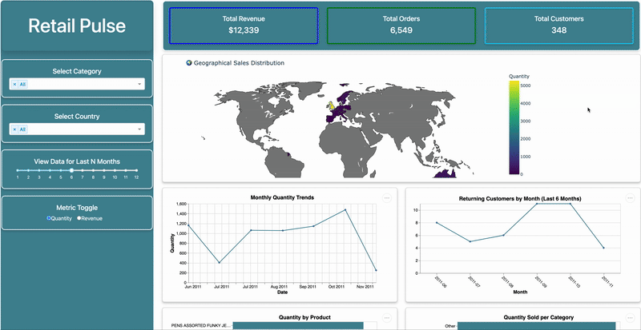

# **RetailPulse: Online Retail Analytics Dashboard**

##### **Authors** : Dhruv Garg, Farhan Bin Faisal, Gilbert Akuja, Lixuan Lin

## **Motivation and Purpose**
Retail operations managers face challenges in managing inventory, tracking sales trends, and identifying market expansion opportunities. Making informed decisions swiftly is crucial to staying competitive. RetailPulse was created to bridge this gap by providing an interactive, data-driven dashboard that enables retailers to gain real-time insights into their business performance. By leveraging historical transactional data, the dashboard uncovers key patterns in revenue trends, customer retention, and product performance, empowering managers to make strategic, evidence-based decisions that drive business growth.


## **Data Attribution**

This project uses data from the [Online Retail Dataset](https://archive.ics.uci.edu/dataset/352/online+retail) availabe on UC Irvine Machine Learning Repository.


## **High Level Description of Dashboard Usage**

- Monitor Sales Trends – Track sales performance over time with interactive line charts.
- Analyze Customer Retention – Identify repeat customers and assess retention trends.
- Explore Market Expansion Opportunities – Use interactive maps to visualize sales distribution across different regions.
- Evaluate Product Performance – Gain insights into top-performing products through bar charts and word clouds.

## **Demo**




## **Running the App Locally**

1. Clone the repository
```bash
git clone https://github.com/UBC-MDS/DSCI-532_2025_15_RetailPulse.git
```
2. Navigate to the project directory
```bash
cd DSCI-532_2025_15_RetailPulse
```

3. Create a conda environment
```bash
conda env create -f environment.yaml
```
4. Activate the environment

```bash
conda activate retailpulse
```
5. Run the application
```bash
python src/app.py
```
## **Support**

For any issues regarding running the dashboard or feature requests, lease contuct the team using [GitHub Issues](https://github.com/UBC-MDS/DSCI-532_2025_15_RetailPulse/issues)

## **Contributing**

The team welcome meaningful contributions to the project. Please find more details on how you can contribute in the [contribution guidelines](https://github.com/UBC-MDS/DSCI-532_2025_15_RetailPulse/blob/main/CONTRIBUTING.md)

## **License**
The **RetailPulse software code** contained in this project is licensed under the **MIT License**. See the [LICENSE](https://github.com/UBC-MDS/DSCI-532_2025_15_RetailPulse/blob/main/LICENSE.md) file for more details.

The **project report** is licensed under the **Attribution-NonCommercial-ShareAlike 4.0 International (CC BY-NC-SA 4.0)** License. See the license file for details. If reusing any part of this code or report, please provide proper attribution by linking to this repository.

## **References**
- [Dataset Source](https://doi.org/10.24432/C5BW33)
- Documentation: [Dash](https://dash.plotly.com/), [Plotly](https://plotly.com/python/), [Pandas](https://pandas.pydata.org/)

