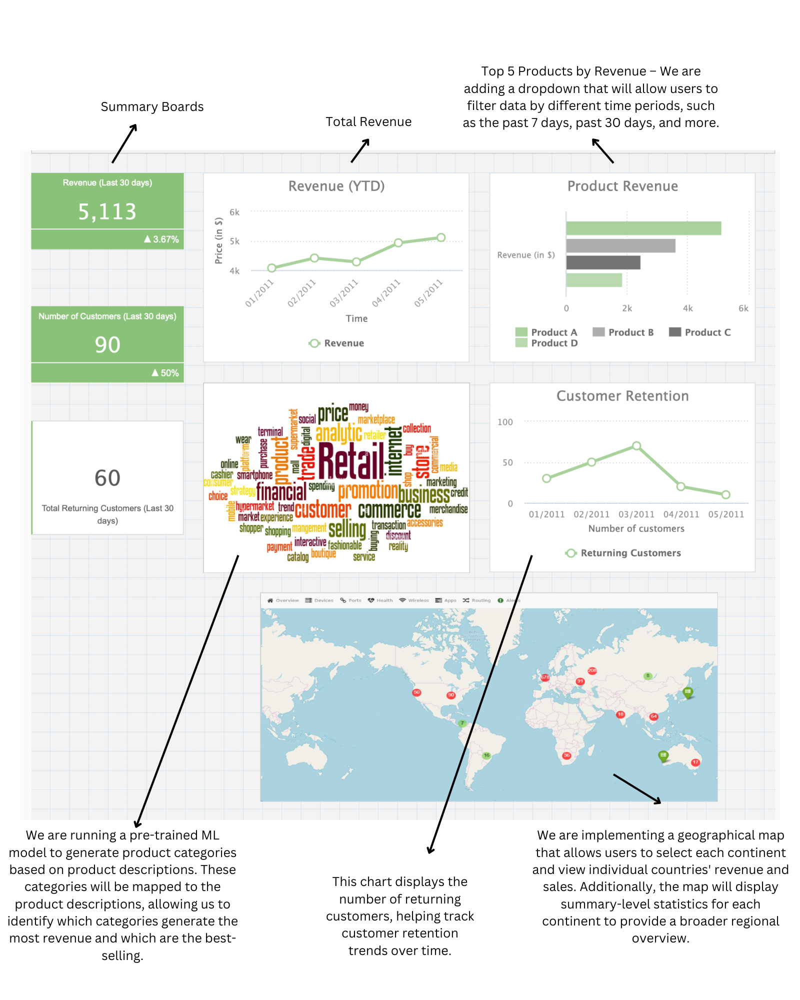

# **Online Retail Dashboard Proposal**

## **1. Motivation and Purpose**  

As a data analytics team, we are creating this dashboard for retail operations managers like Long Nyugen, who struggle to make quick, data-driven decisions about inventory, marketing, and business expansion.  

Currently, managers rely on basic tools like Excel and spend excessive time manually analyzing sales data across different countries, products, and time periods. This makes it difficult to efficiently identify market trends, optimize inventory, and improve customer retention strategies.  

Our interactive dashboard will provide real-time insights on:

- Geographical sales distribution (identifying top-performing countries and continents)
- Revenue trends over time (detecting seasonal patterns)
- Customer retention metrics (understanding repeat buyers)
- Product performance (highlighting top-selling and high-revenue products)
- Product categories contributing to revenue (using ML-based categorization)

Through intuitive visualizations, our dashboard will enable managers to make faster, data-driven decisions, helping them maximize profits, optimize stock levels, and refine marketing efforts.  

---

## **2. About the Online Retail Dataset**  

### **Context**  
This dataset contains transactional data from an online retail store, capturing sales information across various customers and products from December 2010 to June 2011. Each row represents a purchase transaction, with details such as:

- Time of purchase
- Customer ID
- Countries (where the purchases were made)
- Unit Price of products
- Sales Quantity (number of items bought)
- Product Descriptions
- Stock Codes (unique product identifiers)
- Invoice Numbers  

Retail businesses often seek to optimize inventory, understand purchasing patterns, and improve marketing strategies. By analyzing this dataset, we can uncover valuable insights that help businesses enhance customer engagement and sales performance.  

### **Content**  
The dataset consists of 5,000 retail transactions with the following key attributes:

#### **Transaction Details**  
- InvoiceNo: Unique transaction number  
- InvoiceDate: Date and time of the purchase  

#### **Product Information**  
- StockCode: Unique identifier for each product  
- Description: Name of the product  
- UnitPrice: Price per unit of the item  

#### **Purchase Details**  
- Quantity: Number of units purchased in a transaction  
- Derived Variable: Revenue = Quantity × UnitPrice (Total purchase value)  

#### **Customer & Location Information**  
- CustomerID: Unique identifier for customers (some transactions lack this value)  
- Country: Country where the purchase was made  

### **Derived Variables**  
To enhance analysis, we will create new features such as:

- Revenue (Revenue per transaction)
- Repeat Customer Flag (Tracking customer retention)
- Sales Per Country (Aggregating sales by location)
- Product Category Revenue Contribution (Using ML model to categorize products)
- Continental Revenue Summary (Grouping sales at the continent level)  

---

## **3. Research Questions & Usage Scenarios**  

### **Key Questions We Aim to Answer**  

1. How many customers and sales do we have in each country and continent?
   - Chart: Interactive Map allowing users to filter by continent and country
   - Benefit: Identifies high-performing regions and helps in targeted marketing and expansion strategies.

2. What is the total revenue generated in the past few months?
   - Chart: Line Chart showing revenue trends over time
   - Benefit: Tracks sales performance, identifies seasonality, and supports sales forecasting.

3. What is the mean number of returning customers per month?
   - Chart: Line or Bar Chart tracking repeat customer counts
   - Benefit: Helps analyze customer retention and guide targeted advertisements.

4. What are the top five products that generate the most revenue?
   - Chart: Horizontal Bar Chart listing highest revenue-generating products
   - Benefit: Helps optimize inventory decisions and identify key products for marketing.

5. Which product categories generate the most revenue?
   - Chart: Word Cloud with Tooltip displaying top revenue-generating categories
   - Benefit: Guides inventory expansion decisions based on high-performing product categories.
   - Method: Uses a pre-trained ML model to categorize products based on descriptions.  

### **Usage Scenario**  

Long Nyugen is a retail operations manager responsible for optimizing inventory and increasing sales for an international e-commerce business. He wants to analyze sales performance across different countries, identify high-demand products, and understand customer retention trends. 

When Long logs into the dashboard, he first examines the **Total Revenue Panel** to assess recent revenue trends. He then explores the **Geographical Sales Panel** to determine which regions have the highest revenue and filter data by continent and country. Noticing that sales in North America have increased significantly, he further investigates the **Product Performance Panel** to identify top-selling items in that region. 

Long also examines the **Customer Retention Panel** to understand how many repeat customers are making purchases. Based on this insight, he devises a targeted email marketing strategy for first-time buyers to encourage repeat purchases. Finally, he reviews the **Product Category Analysis Panel** to identify which categories contribute most to revenue and ensure that inventory is stocked accordingly. 

With these insights, Long is able to make data-driven decisions on stock replenishment, regional marketing efforts, and customer engagement strategies, ultimately driving business growth.  

---

## **4. App Sketch & Brief Description**  

### **Dashboard Sketch**  
  

### **App Components & Interactions**  

1. Summary Boards
   - Displays Revenue, Number of Customers, and Returning Customers (Last 30 Days)
   - Provides a quick overview of business performance

2. Total Revenue Panel
   - Line Chart: Shows revenue trends over time
   - Helps identify seasonality and revenue growth

3. Product Performance Panel
   - Bar Chart: Displays Top Five Products by Revenue
   - Includes a dropdown filter for different time periods

4. Customer Retention Panel
   - Line Chart: Tracks repeat customer trends
   - Key for understanding customer loyalty

5. Geographical Sales Panel
   - Interactive Map: Allows continent and country selection
   - Shows regional sales summaries and market reach

6. Product Category Analysis Panel
   - Word Cloud: Highlights top-selling categories
   - Uses ML-based categorization to map descriptions to categories

Users can hover over charts for detailed insights. The map allows clicking on continents to view country-wise statistics. Dropdown filters allow for time selection and product segmentation.

